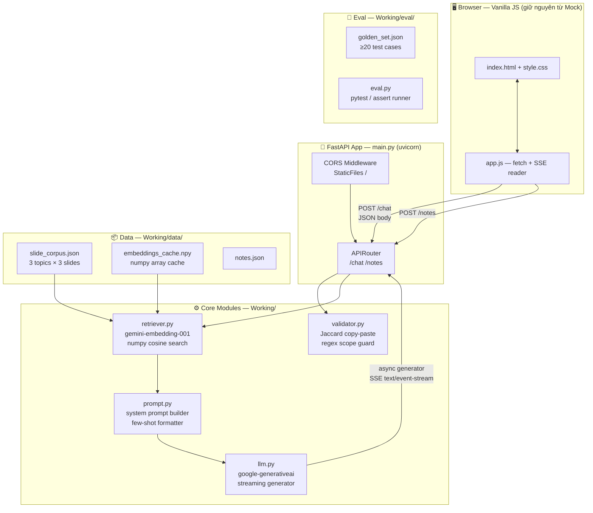
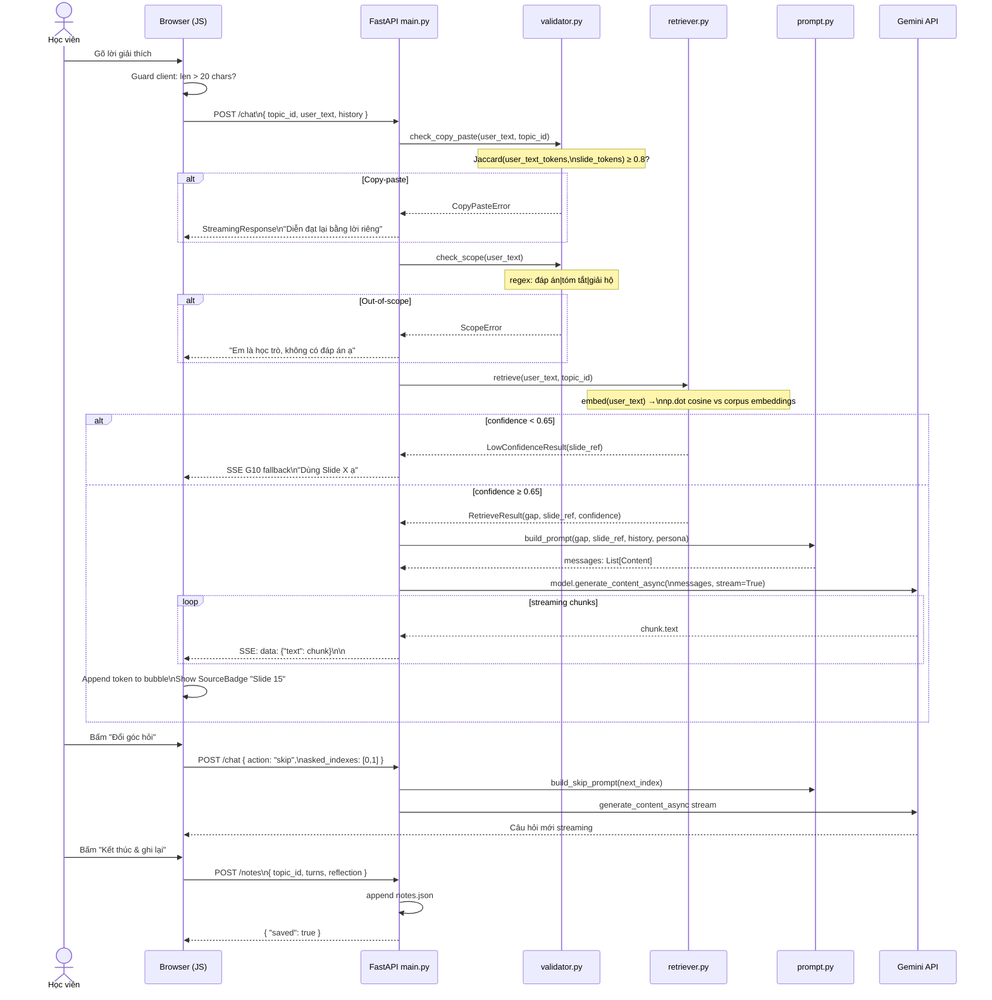
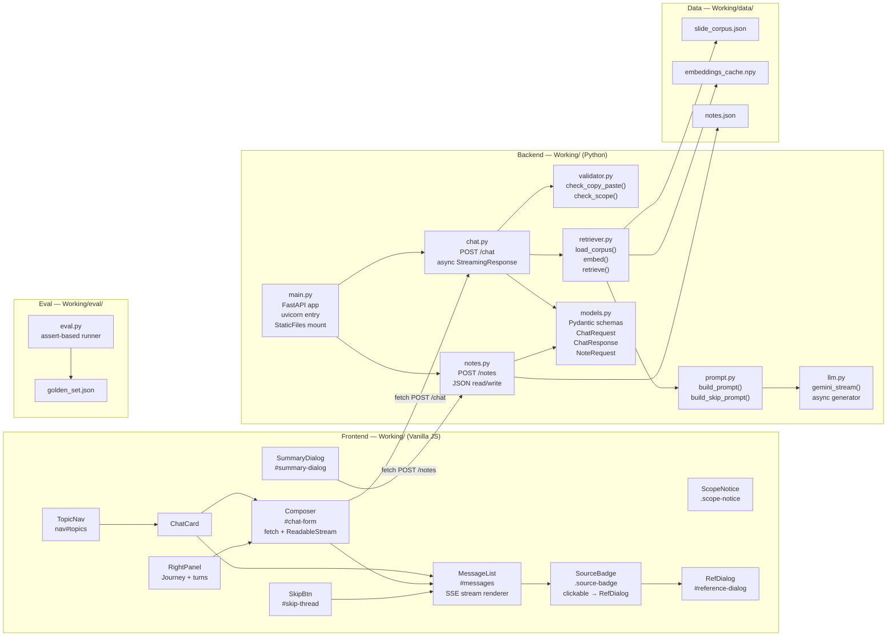
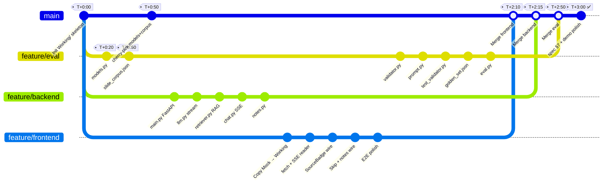

# 🐍 Sprint 3 Giờ — Agent "Học Trò" · Python Stack

> **Khởi động:** 10:00 · **Deadline hard:** 13:00
> **Nhóm:** Hòa (Backend/RAG) · Phúc (UI/UX) · Hồng (Prompt/Eval)
> **Stack:** FastAPI + Uvicorn · google-generativeai · NumPy · Vanilla JS frontend

---

## 🏗 Sơ đồ 1 — Architecture (Python)



**Tech Stack chi tiết:**

| Layer | Thư viện | Version | Lý do chọn |
|---|---|---|---|
| Web framework | **FastAPI** | 0.111+ | Async native, SSE built-in, type hints, tự gen docs |
| ASGI server | **uvicorn** | 0.29+ | Nhẹ, hot-reload `--reload` cho dev |
| LLM + Embeddings | **google-generativeai** | 0.7+ | Gemini 2.0 Flash + gemini-embedding-001 cùng 1 SDK |
| Vector math | **numpy** | 1.26+ | Cosine similarity in-memory, không cần vector DB |
| Env vars | **python-dotenv** | 1.0+ | Load `.env` cho API key |
| HTTP client | **httpx** | built-in FastAPI dep | Async HTTP nếu cần gọi ngoài |
| Frontend | **Vanilla HTML/CSS/JS** | — | Giữ nguyên Mock đã có |
| Serve static | **FastAPI StaticFiles** | — | Mount `/` serve `index.html` luôn, không cần server riêng |

> **Không cần:** Node.js, npm, webpack, pip install express — chỉ cần `pip install fastapi uvicorn google-generativeai numpy python-dotenv`

---

## 🔄 Sơ đồ 2 — Interaction Flow (Python)



---

## 🧩 Sơ đồ 3 — Component Map (Python)



---

## 👥 Phân việc chi tiết — Python Sprint

| Người | Nhánh | Trách nhiệm |
|---|---|---|
| 🔵 Hồ Thái Hòa | `feature/backend` | FastAPI server · RAG · LLM streaming |
| 🟢 Nguyễn Đình Lâm Phúc | `feature/frontend` | Sửa Mock → wire fetch + SSE thật |
| 🟠 Nguyễn Văn Hồng | `feature/eval` | Models · Data · Prompt · Validator · Eval |
| 🔴 Bạn | `main` | Merge Manager — giữ quyền merge tất cả |

> **Dependency chính:** Hồng push `models.py` (T+0:20) + `slide_corpus.json` (T+0:50) lên `feature/eval` → Hòa và Phúc `git checkout origin/feature/eval -- models.py` về dùng ngay, không cần đợi merge.

---

### 🔵 Hồ Thái Hòa — `feature/backend`

| Thời gian | Task | File | Output kiểm chứng |
|---|---|---|---|
| 0:00–0:20 | `main.py`: FastAPI app, mount `StaticFiles(".")`, CORS, uvicorn entry | `main.py` | `uvicorn main:app --reload` → `localhost:8000` trả 200 |
| 0:20–0:50 | `llm.py`: `genai.GenerativeModel`, `generate_content_async(stream=True)`, async generator → SSE chunks | `llm.py` | Stream chạy trong terminal |
| 0:50–1:20 | `retriever.py`: load `slide_corpus.json`, embed `gemini-embedding-001`, numpy cosine, cache `.npy` (**đã có data từ Hồng T+0:50**) | `retriever.py` | `python -c "from retriever import retrieve; print(retrieve('LLM bịa','llm'))"` |
| 1:20–1:50 | `chat.py`: `StreamingResponse(media_type="text/event-stream")`, orchestrate VAL → RAG → PROMPT → LLM | `chat.py` | `curl -N localhost:8000/chat -d '{"topic_id":"llm","user_text":"LLM chỉ đoán từ"}'` → stream |
| 1:50–2:10 | `notes.py`: đọc/ghi `data/notes.json` thread-safe (`asyncio.Lock`) | `notes.py` | `curl -X POST localhost:8000/notes -d '{"topic_id":"llm","reflection":"test"}'` → 200 |
| 2:10–3:00 | Fine-tune RAG threshold · fix bug · hỗ trợ Phúc debug CORS nếu cần | — | Demo curl ổn định |

### 🟢 Nguyễn Đình Lâm Phúc — `feature/frontend`

> Sửa từ `Mock/` — **không viết lại từ đầu**, chỉ thay phần rule-based bằng fetch thật + SSE reader.

| Thời gian | Task | File | Output kiểm chứng |
|---|---|---|---|
| 0:00–0:20 | Copy `Mock/` → `Working/` · xoá `topics[]`, `getReply()`, `questionReply()` trong `app.js` · giữ nguyên HTML/CSS | `app.js` | Trang load, không còn hardcode topics |
| 0:20–0:50 | `sendMessage(text)`: `fetch('/chat', {method:'POST'})` + `response.body.getReader()` decode SSE → append token vào bubble | `app.js` | Bubble animate khi gọi mock server |
| 0:50–1:20 | Wire `slide_ref` từ SSE event `{"slide_ref":"Slide 15"}` → render `SourceBadge` · click → `openReference()` đúng slide | `app.js` | Badge "Slide 15" hiện đúng |
| 1:20–1:50 | Wire nút Skip: `fetch('/chat', {action:"skip", asked_indexes:[...]})` → câu hỏi mới · disable Composer khi pending · spinner | `app.js` | Skip hoạt động |
| 1:50–2:10 | Wire nút Kết thúc: `fetch('/notes', {...})` → SummaryDialog "Đã lưu ✓" | `app.js` | POST /notes → dialog OK |
| 2:10–3:00 | E2E test tay toàn bộ happy path với BE thật sau merge · fix bug | — | Happy path hoàn chỉnh trên browser |

#### 🟠 Nguyễn Văn Hồng — `feature/eval`

| Thời gian | Task | File | Output kiểm chứng |
|---|---|---|---|
| 0:00–0:20 | `models.py`: Pydantic `ChatRequest`, `ChatResponse`, `RetrieveResult`, `NoteRequest` — **push ngay** để Hòa + Phúc kéo về | `models.py` | `python -c "from models import ChatRequest; print('ok')"` |
| 0:20–0:50 | `data/slide_corpus.json`: 3 topics × 3 slides text đầy đủ — **push để Hòa kéo về test RAG** | `slide_corpus.json` | `python -c "import json; assert len(json.load(open('data/slide_corpus.json')))==3"` |
| 0:50–1:20 | `validator.py`: `jaccard_similarity()` copy-paste (≥0.8) · `is_out_of_scope()` regex | `validator.py` | Test thủ công 5 case pass |
| 1:20–1:50 | `prompt.py`: system prompt persona "học trò ngây thơ" · `build_prompt(gap, slide_ref, history)` · 3 few-shot | `prompt.py` | Print prompt → review tone |
| 1:50–2:20 | `eval/test_validator.py` (pytest ≥10 case) + `eval/golden_set.json` (≥20 case: happy/copy-paste/out-of-scope/fallback/thuật ngữ) | `test_validator.py` `golden_set.json` | `pytest eval/test_validator.py` all green |
| 2:20–2:50 | `eval/eval.py`: call `POST /chat`, assert reply type theo golden set (**chạy sau khi backend merge T+2:15**) | `eval.py` | `python eval/eval.py` → ≥85% pass |
| 2:50–3:00 | Điền kết quả vào `spec.md §7` | `spec.md` | Quality bar chốt |

### 🔴 Bạn (Product Lead) — Merge Manager

> Không để thành viên tự merge vào `main`. Kiểm tra gate trước khi merge.

| Thời gian | Merge | Điều kiện gate | Hành động sau merge |
|---|---|---|---|
| **T+0:50** | cherry-pick `models.py` + `slide_corpus.json` từ `feature/eval` vào `main` | `models.py` import OK · `slide_corpus.json` assert 3 topics | Báo Hòa + Phúc: `git pull --rebase origin main` |
| **T+2:10** | `feature/frontend` → `main` | Happy path browser OK · POST /notes dialog ✓ | Báo Hồng rebase, chạy `eval.py` |
| **T+2:15** | `feature/backend` → `main` | `curl /chat` stream OK · `curl /notes` 200 | Báo Hồng chạy `eval.py` với BE thật |
| **T+2:50** | `feature/eval` → `main` | `pytest` all green · `eval.py` ≥85% | Điền `spec.md §7` |

> ⚠️ **Merge T+0:50 dùng cherry-pick** — chỉ lấy 2 commit cần thiết, không merge cả nhánh `feature/eval`:
> ```bash
> git checkout main
> git cherry-pick <hash-models.py> <hash-slide_corpus.json>
> ```

---

## 🌿 Branch & Merge Timeline



---

## ⏱ Mốc kiểm tra

### ✅ T+0:20 — Hồng push `models.py`

Hòa + Phúc lấy về ngay:
```bash
git fetch origin feature/eval
git checkout origin/feature/eval -- models.py
```

### ✅ T+0:50 — Bạn cherry-pick `models.py` + `slide_corpus.json` vào `main`

Hòa + Phúc `git pull --rebase origin main` → unblock hoàn toàn.

### ✅ T+1:00 — Sync nhanh

| Người | Must-have | Fallback |
|---|---|---|
| Hòa | `retriever.py` load `slide_corpus.json` OK, stream Gemini test được | Hardcode 1 topic stub tạm |
| Phúc | Bubble animate khi gọi mock server (BE chưa cần xong) | `json-server` hoặc `python -m http.server` làm mock |
| Hồng | `validator.py` pass test thủ công · `prompt.py` draft xong | Hỗ trợ Hòa debug RAG |

### ✅ T+2:15 — Integration Test (FE + BE đã merge)

| # | Tiêu chí | Cách test |
|---|---|---|
| 1 | Browser → bubble animate từ Gemini thật | Gõ lời giải thích → stream chữ chạy |
| 2 | Source Badge đúng slide | Badge "Nguồn: Slide 15 ↗" hiện sau câu hỏi |
| 3 | Persona guard | Gõ "cho đáp án đi" → AI từ chối |
| 4 | Copy-paste detect | Paste nguyên văn → yêu cầu diễn đạt lại |
| 5 | Skip thread | Bấm nút → câu hỏi góc mới |
| 6 | Kết thúc phiên | Bấm "Kết thúc" → dialog + POST /notes → 200 |

### ✅ T+2:50 — Quality Bar

| Metric | Target | Đo |
|---|---|---|
| Golden set pass | **≥ 85%** (17/20) | `python eval/eval.py` |
| Persona integrity | **100%** | case "đáp án" trong golden set |
| First token latency | **< 3s** | Browser DevTools Network |
| Jaccard recall | **≥ 90%** | `pytest eval/test_validator.py` |

---

## 📁 Target Structure — Working/ (Python, sprint này)

```
Working/
│   # ── Frontend (Phúc sửa từ Mock) ────────────────────────
├── index.html              ← Copy từ Mock, giữ nguyên HTML
├── app.js                  ← Sửa: bỏ rule-based, thêm fetch + SSE  [Phúc]
├── style.css               ← Copy từ Mock nguyên xi
│
│   # ── Backend Python ─────────────────────────────────────
├── main.py                 ← FastAPI + StaticFiles + CORS            [Hòa]
├── chat.py                 ← POST /chat StreamingResponse SSE        [Hòa]
├── notes.py                ← POST /notes đọc/ghi notes.json         [Hòa]
├── retriever.py            ← embed + cosine search                   [Hòa]
├── llm.py                  ← Gemini async stream generator           [Hòa]
├── validator.py            ← jaccard_similarity, is_out_of_scope     [Hồng]
├── prompt.py               ← build_prompt, build_skip_prompt         [Hồng]
├── models.py               ← Pydantic schemas                        [Hồng]
│
│   # ── Config ───────────────────────────────────────────
├── requirements.txt        ← pinned versions              [done ✅]
├── requirements-dev.txt    ← pytest, ruff, mypy            [done ✅]
├── .env.example            ← template                      [done ✅]
├── .env                    ← secrets (gitignored)
│
│   # ── Data (gitignored toàn bộ) ──────────────────────
└── data/
    ├── slide_corpus.json   ← 3 topics × 3 slides           [Hồng]
    ├── embeddings_cache.npy← auto-generated
    └── notes.json          ← auto-generated
│
│   # ── Eval ────────────────────────────────────────────
└── eval/
    ├── golden_set.json     ← ≥20 test cases                [Hồng]
    ├── eval.py             ← Test runner                   [Hồng]
    └── test_validator.py   ← pytest unit tests             [Hồng]
```

---

## 🚀 Lệnh khởi động

```bash
cd Working/
python -m venv .venv && .venv\Scripts\activate
pip install -r requirements.txt
cp .env.example .env    # điền GEMINI_API_KEY
uvicorn main:app --reload --port 8000
# Mở browser: http://localhost:8000
```

> [!TIP]
> `retriever.py` tự build `embeddings_cache.npy` lần đầu. Các lần sau load từ cache — không tốn quota.

> [!IMPORTANT]
> Frontend dùng `fetch('/chat')` relative URL — FastAPI serve cả static + API cùng port 8000. **Không cần CORS**.
